# JavaWeb
## Maven
### 简介
- Maven是Apache旗下的一个开源项目，是一款用于管理和构建java项目的工具，它基于项目对象模型（POM project object model）的概念，通过一小段描述信息来管理项目的构建  
[Maven官网](https://maven.apache.org/)
### Apache
- Apache 软件基金会，成立于1999年7月，是目前世界上最大的最受欢迎的开源软件基金会，也是一个专门为支持开源项目而生的非盈利性组织  
[开源项目列表](https://www.apache.org/index.html#projects-list)
### Maven的作用
#### 方便的依赖管理
- 方便快捷的管理项目依赖的资源（jar包），避免版本冲突问题  
Maven工程只需要在pom.xml配置文件中配置一块描述信息（需要配置的依赖以及所需的版本）
#### 统一的项目结构
- 提供标准、统一的项目结构
<!--  -->
<p align="center">
    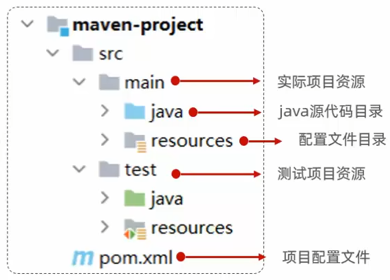
</p>

#### 标准的项目构建流程
- 标准跨平台（Linux、Windows、MacOS）的自动化项目构建方式，即基于Maven提供的指令快速完成项目的清理、编译、测试、打包、发布等操作（编译后的字节码文件、打包后的jar文件等存放于target目录下）
### Maven的目录
#### bin目录
- 存放可执行文件
#### conf目录
- 存放配置文件
#### lib目录
- 存放依赖的jar包资源
### Maven的安装
- 配置本地仓库  
- 配置阿里云私服  
- 配置环境变量
<p align="center">
    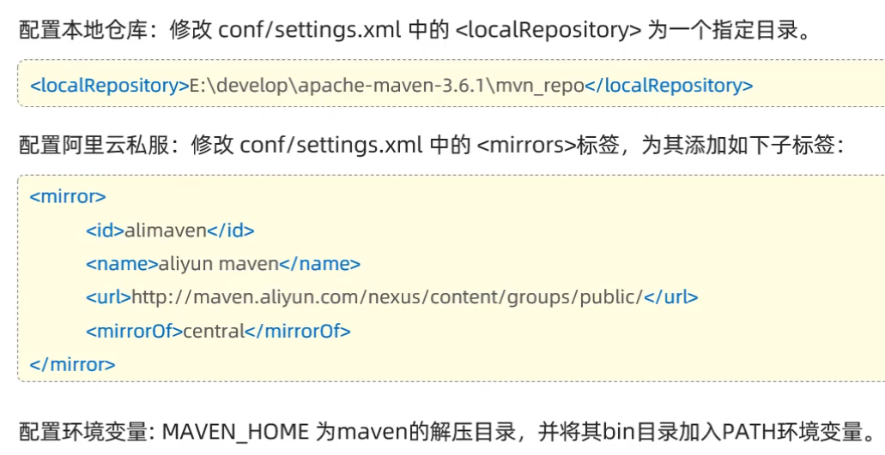
</p>

- Maven运行依赖于JDK环境，项目配置中Maven关联的JRE版本以及Java语言的字节码版本等需保证与`mvn -v`指令中查看到的Java Version版本一致
### IDEA集成Maven
#### 配置Maven环境（当前工程）
- [教程链接](https://www.bilibili.com/video/BV1m84y1w7Tb?t=37.7&p=52)
#### 配置Maven环境（全局）
- [教程链接](https://www.bilibili.com/video/BV1m84y1w7Tb?t=231.3&p=52)
#### 创建Maven项目
- [教程链接](https://www.bilibili.com/video/BV1m84y1w7Tb?t=345.8&p=52)
#### 导入Maven项目
- [教程链接](https://www.bilibili.com/video/BV1m84y1w7Tb?t=5.8&p=53)
### Maven坐标
#### 什么是坐标
- Maven中的坐标是资源的唯一标识，通过该坐标可以唯一定位资源位置  
- 使用坐标来定义项目或引入项目中需要的依赖
#### Maven坐标主要组成
- groupld：定义当前Maven项目隶属组织名称（通常是域名反写，例如:com.itheima）  
- artifactld：定义当前Maven项目名称（通常是模块名称，例如 order-service、goods-service）  
- version：定义当前项目版本号
### 依赖管理
#### 依赖配置
- [教程链接](https://www.bilibili.com/video/BV1m84y1w7Tb?t=32.8&p=54)（如果不知道依赖的坐标信息，可以到[mvn仓库](https://mvnrepository.com/)中搜索）
#### 依赖传递
- [教程链接](https://www.bilibili.com/video/BV1m84y1w7Tb?t=71.9&p=55)（排除依赖）
#### 依赖范围
- [教程链接](https://www.bilibili.com/video/BV1m84y1w7Tb?t=2.2&p=56)
#### 生命周期
- Maven的生命周期就是为了对所有的maven项目构建过程进行抽象和统一  
[教程链接](https://www.bilibili.com/video/BV1m84y1w7Tb?t=0.2&p=57)
<p align="center">
    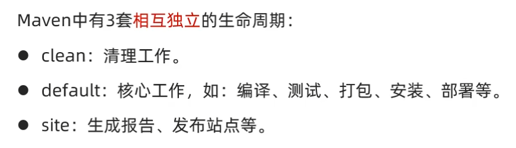
</p>

- Maven的生命周期以及生命周期的各个阶段都是抽象的概念，并不执行具体的操作，而是由与其绑定的Maven插件来完成的，Maven本质是一个插件执行框架，所有工作都由插件完成，主要的五个阶段如下：  
clean：清理  
compile：编译  
test：测试  
package：打包  
install：安装
## HTTP协议
### 概念
- Hyper Text Transfer Protocol，超文本传输协议，规定了浏览器和服务器之间数据传输的规则
### 特点
- 基于TCP协议：面向连接，安全
- 基于请求-响应模型：一次请求对应一次响应
- 无状态的协议：对于事务处理没有记忆能力，每次请求-响应都是独立的，速度快但是多次请求间不能共享数据
### 请求协议
#### 请求行
- 请求数据第一行（请求方式、资源路径、协议）
- 请求方式-GET：请求参数在请求行中，没有请求体，如：/brand/findALL?name=OPPO&status=1，GET请求大小是有限制的
- 请求方式-POST：请求参数在请求体中，POST请求大小是没有限制的
#### 请求头
- 第二行开始，与请求体空行相隔，格式：key：value
- 常见的请求头及含义如下：

    请求头|含义
    :-:|:-
    Host|请求的主机名
    User-Agent|浏览器版本，例如Chrome浏览器的标识类似Mozila/5.0...Chrome/79，IE浏览器的标识类似Mozila/5.0(WindowsNT...) like Gecko
    Accept|表示浏览器能接收的资源类型，如text/*，image/*或者*/*表示所有
    Accept-Language|表示浏览器偏好的语言，服务器可以据此返回不同语言的网页
    Accept-Encoding|表示浏览器可以支持的压缩类型，例如gzip，deflate等
    Content-Type|请求主体的数据类型
    Content-Length|请求主体的大小（单位：字节）
<!--
Host|User-Agent|Accept|Accept-Language|Accept-Encoding|Content-Type|Content-Length
:-:|:-:|:-:|:-:|:-:|:-:|:-:
请求的主机名|浏览器版本，例如Chrome浏览器的标识类似Mozila/5.0...Chrome/79，IE浏览器的标识类似Mozila/5.0(WindowsNT...) like Gecko|表示浏览器能接收的资源类型，如text/*，image/*或者*/*表示所有|表示浏览器偏好的语言，服务器可以据此返回不同语言的网页|表示浏览器可以支持的压缩类型，例如gzip，deflate等|请求主体的数据类型|请求主体的大小（单位：字节）
-->
#### 请求体
- POST请求，存放请求参数
### 响应协议
#### 响应行
- 响应数据第一行（协议、状态码、描述）
- [响应状态码大全](https://cloud.tencent.com/developer/chapter/13553)，重点响应状态码及含义如下：

    状态码|含义
    :-:|:-
    200|客户端请求成功
    404|请求资源不存在，一般是URL输入有误，或者网站资源被删除了
    500|服务器发生不可预期的错误
#### 响应头
- 第二行开始，与响应体空行相隔，格式：key：value
- 常见的响应头及含义如下：

    响应头|含义
    :-:|:-
    Content-Type|表示该响应内容的类型，例如text/html，application/json
    Content-Length|表示该响应内容的长度（字节数）
    Content-Encoding|表示该响应压缩算法，例如gzip
    Cache-Control|指示客户端应如何缓存，例如max-age=300表示可以最多缓存300秒
    Set-Cookie|告诉浏览器为当前页面所在的域设置cookie
#### 响应体（响应正文）
- 最后一部分，存放响应数据
### 协议解析
- HTTP协议是标准的、统一固定的，解析HTTP协议的代码是非常通用的，将这部分代码封装的软件程序就是Web服务器（jetty、WebLogic、WebSphere、Apache Tomcat等），使程序员不必对繁琐的HTTP协议进行操作，仅需关注于项目的业务逻辑实现，使Web程序的开发更加简单、便捷、高效
- Web服务器是一个软件程序，对HTTP协议的操作进行封装，使得程序员不必直接对协议进行操作，让Web开发更加便捷，主要功能是部署Web项目，对外提供网上信息浏览服务
## Tomcat
### 简介
- 概念：Tomcat是Apache软件基金会的一个核心项目，是一个开源免费的轻量级Web服务器，支持Servlet、JSP等少量JavaEE规范
- JavaEE：Java Enterprise Edition，Java企业版（JavaSE：Java标准版；JavaME：Java小型版），指Java企业级开发的技术规范总和，包含13项技术规范:JDBC、JNDI、EJB、RMI、JSP、Servlet（基于Servlet规范开发的一种Web资源）、XML、JMS、Java IDL、JTS、JTA、JavaMail、JAF
- Tomcat也被称为Web容器、Servlet容器，Servlet程序需要依赖于Tomcat才能运行
- [Tomcat官网](https://tomcat.apache.org/)
### 基本使用
#### 目录结构
<p align="center">
    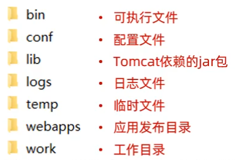
</p>

#### 启动Tomcat
- 双击bin\startup.bat
<p align="center">
    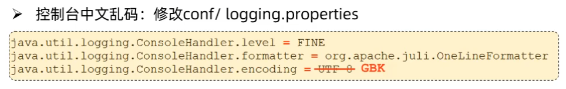
</p>

#### 关闭Tomcat
- 关闭运行窗口：强制关闭
- 双击bin\shutdown.bat，正常关闭
- Ctrl+C：正常关闭
#### 常见问题
- 启动窗口一闪而过：检查JAVA_HOME环境变量是否正确配置
- 端口号冲突：找到对应程序，将其关闭掉
#### 配置Tomcat端口号
- conf/server.xml配置文件中修改port的值（69行）
- HTTP协议默认端口号为80，如果将Tomcat端口号改为80，则将来访问Tomcat时，将不用输入端口号
#### Tomcat部署项目
- 将项目放置到webapps目录下，即部署完成
## Spring
### 简介
- Sprina发展到今天已经形成了一种开发生态圈，Spring提供了若干个子项目，每个项目用于完成特定的功能  
[Spring官网](https://spring.io)
## Spring Boot
### 简介
- Spring Boot是Spring家族的一个子项目，可以帮助我们非常快速的构建Spring应用程序、简化Spring应用程序的配置开发从而提高开发效率
### 起步依赖
- spring-boot-starter-web：包含了Web应用开发所需要的常见依赖
- spring-boot-starter-test：包含了单元测试所需要的常见依赖
- [官方提供的starter](https://docs.spring.io/spring-boot/docs/2.7.4/reference/htmlsingle/#using.build-systems.starters)
- 基于Spring Boot开发的Web应用程序，内置了Tomcat服务器，当启动类运行时，会自动启动内嵌的Tomcat服务器
## 请求响应
### 概述
- DispatcherServlet（核心控制器/前端控制器）：可以被Tomcat识别的Servlet程序，接收前端浏览器发起的请求，转发给各个Controller程序，接收Controller程序处理后的结果给浏览器响应数据
- 请求（HttpServletRequest）：获取请求数据
- 响应（HttpServletResponse）：设置响应数据
- BS架构：Browser/Server，浏览器/服务器架构模式，客户端只需要浏览器，应用程序的逻辑和数据都存储在服务端（维护方便 体验一般）
- CS架构：Client/Server，客户端/服务器架构模式（开发、维护麻烦 体验不错）
### 请求
#### Postman
- Postman是一款功能强大的网页调试与发送网页HTTP请求的Chrome插件，常用于进行接口测试  
[Postman基本使用教程](https://www.bilibili.com/video/BV1m84y1w7Tb?t=203.8&p=68)
#### 简单参数的接收
- 原始方式获取请求参数：Controller方法形参中声明HttpServletRequest对象，调用对象的getParameter(参数名)
<p align="center">
    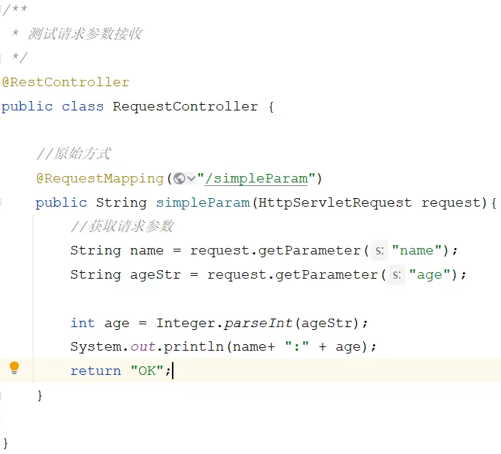
</p>

- SpringBoot中接收简单参数：请求参数名与方法形参变量名相同，会自动进行类型转换
<p align="center">
    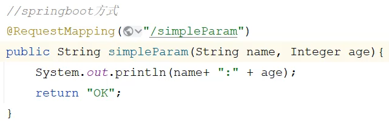
</p>

- @RequestParam注解：方法形参名称与请求参数名称不匹配，通过该注解完成映射，该注解的required属性默认是true，代表请求参数必须传递
<p align="center">
    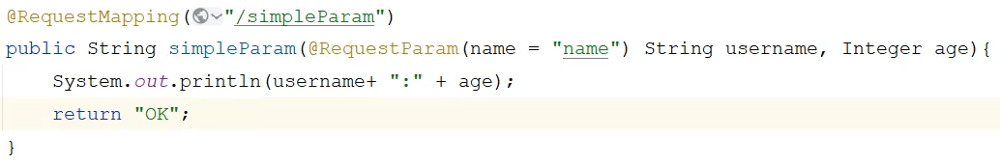
</p>

#### 实体参数的接收
- 简单实体对象：请求参数名与形参对象属性名相同，定义POJO接收即可
- 复杂实体对象：请求参数名与形参对象属性名相同，按照对象层次结构关系即可接受嵌套POJO属性参数
#### 数组集合参数
- 数组参数：请求参数名与形参数组名称相同且请求参数为多个，定义数组类型形参即可接收参数
- 集合参数：请求参数名与形参集合名称相同且请求参数为多个，@RequestParam绑定参数关系
#### 日期参数
- 使用@DataTimeFormat注解完成日期参数格式转换
#### Json参数
- JSON数据键名与形参对象属性名相同，定义POJO类型形参即可接收参数，需要使用@RequestBody标识
#### 路径参数
- 通过请求URL直接传递参数，使用{...}来标识该路径参数，需要使用@PathVariable获取路径参数
### 响应
#### @ResponseBody
- 类型：方法注解、类注解
- 位置：Controller方法上/类上
- 作用：将方法返回值直接响应，如果返回值类型是实体对象/集合，将会转换为JSON格式响应
- 说明：@RestController=@Controller+@ResponseBody
#### 统一响应结果
```
public class Result {
    //响应码，1代表成功，0代表失败
    private Integer code;
    //提示信息
    private String msg;
    //返回的数据
    private Object data;
    //......
}
```
#### 案例
- [案例视频](https://www.bilibili.com/video/BV1m84y1w7Tb?t=0.2&p=74)
- SpringBoot项目的静态资源（html、css、js等前端资源）默认存放目录为：classpath:/static、classpath:/public、classpath:/resources
## 分层解耦
### 三层架构
- 软件设计以及软件开发过程中尽量保证每一个接口类或方法秉持单一职责原则，使得复杂度更低、可读性更强、拓展性更好，也更利于后期的维护
#### Controller
- 控制层，接收前端发送的请求，对请求进行处理，并响应数据
#### Service
- 业务逻辑层，处理具体的业务逻辑
#### Dao
- 数据访问层（Data Access Object）（持久层），负责数据访问操作，包括数据的增、删、改、查
- 数据访问Dao层的实现方式有很多（访问文件中、数据库中、别人提供的接口获取到的数据），为了灵活的切换各种实现，通过面向接口的方式进行编程，即在编写dao层的具体实现前，先定义一个dao接口来增强程序的灵活性及拓展性  
[接口定义示例](https://www.bilibili.com/video/BV1m84y1w7Tb?t=389.7&p=75)
### 分层解耦
#### 内聚
- 软件中各个功能模块内部的功能联系
#### 耦合
- 衡量软件中各个层/模块之间的依赖、关联的程度
#### 控制反转
- Inversion Of Control，简称IOC，对象的创建控制权由程序自身转移到外部（容器），这种思想称为控制反转
#### 依赖注入
- Dependency Injection，简称DI，容器为应用程序提供运行时，所依赖的资源，称之为依赖注入
#### Bean对象
- IOC容器中创建、管理的对象，称之为bean
### IOC详解
#### Bean的声明
- 要把某个对象交给IOC容器管理，需要在对应的类上加上如下注解之一：

    注解|说明|位置
    :-|:-|:-
    @Component|声明bean的基础注解|不属于以下三类时，用此注解
    @Controller|@Component的衍生注解|标注在控制器类上
    @Service|@Component的衍生注解|标注在业务类上
    @Repository|@Component的衍生注解|标注在数据访问类上（由于与mybatis整合，用的少）
- 声明bean的时候，可以通过value属性指定bean的名字，如果没有指定，默认为类名首字母小写
- 使用以上四个注解都可以声明bean，但是在springboot集成web开发中，声明控制器bean只能用@Controller
#### Bean组件扫描
- 前面声明bean的四大注解，要想生效，还需要被组件扫描注解@ComponentScan扫描
- @ComponentScan注解虽然没有显式配置，但是实际上已经包含在了启动类声明注解@SpringBootApplication中，默认扫描的范围是启动类所在包及其子包
### DI详解
#### Bean注入
- @Autowired注解，默认是按照类型自动装配，如果存在多个相同类型的bean，将会报错，可以通过以下几种方案来解决：
    - @Primary：在类上加@Primary注解，代表让当前bean生效
    - @Qualifier：在@Autowired注解上加@Qualifier注解，用value属性指定bean的名字
    - @Resource：，按照名称进行注入，不同于@Autowired注解由spring框架提供，@Resource注解由jdk提供，代替@Autowired注解，用name属性指定bean的名字
## MySQL
### 概述
#### 什么是数据库？
- 数据库：DataBase（DB），是存储和管理数据的仓库
- 数据库管理系统：DataBase Management System（DBMS），操纵和管理数据库的大型软件
- SQL：Structured Query Language，操作关系型数据库的编程语言，定义了一套操作关系型数据库的统一标准
#### MySQL安装
- [官网下载地址](https://dev.mysql.com/downloads/mysql/)
- [安装配置教程](https://www.bilibili.com/video/BV1m84y1w7Tb?t=116.9&p=81)
#### MySQL数据模型
- 关系型数据库（RDBMS）：建立在关系模型基础上，由多张相互连接的二维表组成的数据库
    - 使用表存储数据，格式统一，便于维护
    - 使用SQL语言操作，标准统一，使用方便，可用于复杂查询
#### SQL简介
- SQL：一门操作关系型数据库的编程语言，定义操作所有关系型数据库的统一标准
- 通用语法：
    - SQL语句可以单行或多行书写，以分号结尾
    - SQL语句可以使用空格/缩进来增强语句的可读性
    - MySQL数据库的SQL语句不区分大小写
    - 注释：
        - 单行注释：-- 注释内容 或 # 注释内容（MySQL特有）
        - 多行注释：/\*注释内容\*/
#### SQL分类
- SQL语句通常被分为四大类：

    分类|全称|说明
    :-:|:-|:-
    DDL|Data Definition Language|数据定义语言，用来定义数据库对象（数据库，表，字段）
    DML|Data Manipulation Language|数据操作语言，用来对数据库表中的数据进行增删改
    DQL|Data Query Language|数据查询语言，用来查询数据库中表的记录
    DCL|Data Control Language|数据控制语言，用来创建数据库用户、控制数据库的访问权限
### DDL
- Data Definition Language，数据定义语言，用来定义数据库对象（数据库，表，字段）
#### 数据库操作
- 查询
    - 查询所有数据库：`show databases;`
    - 查询当前数据库：`select database();`
- 创建
    - 创建数据库：`create database[if not exits] 数据库名;`
- 使用
    - 使用数据库：`use 数据库名;`
- 查询
    - 删除数据库：`drop database[if exits] 数据库名;`
- 上述语法中的database，也可以替换成schema，如：`create schema db01;`
#### MySQL客户端工具-图形化工具
- DataGrip：DataGrip是JetBrains旗下的一款数据库管理工具，是管理和开发MySQL、Oracle、PostgreSQL的理想解决方案（已集成在IDEA中）  
[官网](https://www.jetbrains.com/zh-cn/datagrip/)
#### 表结构操作
- 创建
    ```
    create table 表名(
        字段1 字段类型 [约束] [comment 字段1注释],
        ......
        字段n 字段类型 [约束] [comment 字段n注释]
    )[comment 表注释];
    ```
- 约束
    - 概念：约束是作用于表中字段上的规则，用于限制存储在表中的数据
    - 目的：保证数据库中数据的正确性、有效性和完整性
    - MySQL中提供的主要五种约束如下：
    
        约束|描述|关键字
        :-:|:-|:-
        非空约束|限制该字段值不能为null|not null
        唯一约束|保证字段的所有数据都是唯一、不重复的|unique
        主键约束|主键是一行数据的唯一标识，要求非空且唯一|primary key（auto_increment自增）
        默认约束|保存数据时，如果未指定该字段值，则采用默认值|default
        外键约束|让两张表的数据建立连接，保证数据的一致性和完整性|foreign key
#### 数据类型
- MySQL中的数据类型有很多，主要分为三类：数值类型、字符串类型、日期时间类型  
参照《MySQL数据类型》
- 注意事项：  
create time：记录的是当前这条数据插入的时间  
update time：记录当前这条数据最后更新的时间
#### 查询&修改&删除
- 查询
    - 查询当前数据库所有表：`show tables;`
    - 查询表结构：`desc 表名;`
    - 查询建表语句：`show create table 表名;`
- 修改
    - 添加字段：`alter table 表名 add 字段名 类型(长度) [comment 注释] [约束];`
    - 修改字段类型：`alter table 表名 modify 字段名 新数据类型(长度);`
    - 修改字段名和字段类型：`alter table 表名 change 旧字段名 新字段名 类型(长度) [comment 注释] [约束];`
    - 删除字段：`alter table 表名 drop column 字段名;`
    - 修改表名：`rename table 表名 to 新表名;`
- 删除
    - 删除表：`drop table [if exits] 表名;`
    - 注意事项：在删除表时，表中的全部数据也会被删除
### DML
- Data Manipulation Language，数据操作语言，用来对数据库表中的数据进行增删改
#### 添加数据（INSERT）
- 指定字段添加数据：`insert into 表名(字段名1,字段名2) values(值1,值2);`
- 全部字段添加数据：`insert into 表名 values(值1,值2,...);`
- 批量添加数据（指定字段）：`insert into 表名(字段名1,字段名2) values(值1,值2),(值1,值2);`
- 批量添加数据（全部字段）：`insert into 表名 values(值1,值2,...),(值1,值2,...);`
- 获取当前系统时间：`now()`
- 注意事项：
    - 插入数据时，指定的字段顺序需要与值的顺序是一一对应的
    - 字符串和日期型数据应该包含在引号中
    - 插入的数据大小，应该在字段的规定范围内
#### 修改数据（UPDATE）
- 修改数据：`update 表名 set 字段名1=值1,字段名2=值2,...[where 条件];`
- 注意事项：修改语句的条件可以有，也可以没有，如果没有条件，则会修改整张表的所有数据
#### 删除数据（DELETE）
- 删除数据：`delete from 表名 [where 条件];`
- 注意事项：
    - DELETE语句的条件可以有，也可以没有，如果没有条件，则会删除整张表的所有数据
    - DELETE语句不能删除某一个字段的值（如果要操作，可以使用UPDATE，将该字段的值置为NULL）
### DQL
- Data Query Language，数据查询语言，用来查询数据库中表的记录
- 基本语法：
    ```
    select
        字段列表
    from
        表名列表
    where
        条件列表
    group by
        分组字段列表
    having
        分组后条件列表
    order by
        排序字段列表
    limit
        分页参数
    ```
#### 基本查询
- 查询多个字段：`select 字段1,字段2,字段3 from 表名;`
- 查询所有字段（通配符）：`select * from 表名;`
- 设置别名：`select 字段1 [as 别名1],字段2 [as 别名2] from 表名;`
- 去除重复记录：`select distinct 字段列表 from 表名;`
- 注意事项：`*`号代表查询所有字段，在实际开发中尽量少用（不直观、影响效率）
#### 条件查询
- 条件查询：`select 字段列表 from 表名 where 条件列表;`
- 条件的构建方式（sql语句中构建条件的运算符）：
    - 比较运算符：

        比较运算符|功能
        :-|:-
        \>|大于
        \>=|大于等于
        <|小于
        <=|小于等于
        =|等于
        <> 或 !=|不等于
        between...and...|在某个范围之内（含最小、最大值）
        in(...)|在in之后的列表中的值，多选一
        like 占位符|模糊匹配（_匹配单个字符，%匹配任意个字符）
        is null|是null
    - 逻辑运算符：

        逻辑运算符|功能
        :-|:-
        and 或 &&|并且（多个条件同时成立）
        or 或 \|\||或者（多个条件任意一个成立）
        not 或 ！|非，不是
#### 聚合函数
- 介绍：将一列数据作为一个整体，进行纵向计算
- 语法：`select 聚合函数(字段列表) from 表名;`
- 常见聚合函数：

    函数|功能
    :-:|:-:
    count|统计数量
    max|最大值
    min|最小值
    avg|平均值
    sum|求和
- 注意事项：
    - null值不参与所有聚合函数运算
    - 统计数量可以使用：`count(*)`、`count(字段)`、`count(常量)`，推荐使用`count(*)`
#### 分组查询
- 分组查询：`select 字段列表 from 表名 [where 条件] group by 分组字段名 [having 分组后过滤条件];`
- `where`与`having`的区别：
    - 执行时机不同：`where`是分组之前进行过滤，不满足`where`条件，不参与分组；而`having`是分组之后对结果进行过滤
    - 判断条件不同：`where`不能对聚合函数进行判断，而`having`可以
- 注意事项：
    - 分组之后，查询的字段一般为聚合函数和分组字段，查询其他字段无任何意义
    - 执行顺序：`where` > `聚合函数` > `having`
#### 排序查询
- 排序查询：`select 字段列表 from 表名 [where 条件] [group by 分组字段] order by 字段1 排序方式1,字段2 排序方式2...;`
- 排序方式：
    - `ASC`：升序（默认值）
    - `DESC`：降序
- 注意事项：如果是多字段排序，当第一个字段值相同时，才会根据第二个字段进行排序
#### 分页查询
- 分页查询：`select 字段列表 from 表名 limit 起始索引,查询记录数;`
- 注意事项：
    - 起始索引从0开始，起始索引=（查询页码-1）*每页显示记录数
    - 分页查询是数据库的方言，不同的数据库有不同的实现，MySQL中是LIMIT
    - 如果查询的是第一页数据，起始索引可以省略，直接简写为limit 10
#### 流程控制函数
- `if(表达式,tvalue,fvalue)`：当表达式为true时，取值tvalue；当表达式为false时，取值fvalue
- `case expr when value1 then result1 [when value2 then value2...] [else result] end`
### DCL
- Data Control Language，数据控制语言，用来创建数据库用户、控制数据库的访问权限
### 多表设计
#### 概述
- 项目开发中，在进行数据库表结构设计时，会根据业务需求及业务模块之间的关系，分析并设计表结构，由于业务之间相互关联，所以各个表结构之间也存在着各种联系，基本上分为三种：
    - 一对多（多对一）
    - 多对多
    - 一对一
#### 一对多
- 一对多关系的实现：在数据库表中多的一方（子表），添加字段，来关联一的一方（父表）的主键
- 外键语法：
    ```
    --创建表时指定
    create table 表名(
        字段名 数据类型,
        ...
        [constraint] [外键名称] foreign key(外键字段名) references 主表(字段名)
    );
    --建表完成后，添加外键
    alter table 表名 add constraint 外键名称 foreign key(外键字段名) references 主表(字段名);
    ```
- 外键约束
    - 物理外键：
        - 概念：使用foreign key定义外键关联另外一张表
        - 缺点：
            - 影响增、删、改的效率（需要检查外键关系）
            - 仅用于单节点数据库，不适用与分布式、集群场景
            - 容易引发数据库的死锁问题，消耗性能
    - 逻辑外键（推荐）
        - 概念：在业务层逻辑中，解决外键关联
        - 通过逻辑外键，就可以很方便地解决上述问题
#### 一对一
- 关系：一对一关系，多用于单表拆分，将一张表的基础字段放在一张表中，其他字段放在另一张表中，以提升操作效率
- 实现：在任意一方加入外键，关联另外一方的主键，并且设置外键为唯一的（UNIQUE）
#### 多对多
- 实现：建立第三张中间表，中间表至少包含两个外键，分别关联两方主键
#### 表结构设计步骤
1. 阅读页面原型及需求文档，分析各个模块涉及到的表结构，及表结构之间的关系
2. 根据页面原型及需求文档分析各个表结构中具体的字段及约束
### 多表查询
#### 概述
- 多表查询：指从多张表中查询数据
- 笛卡尔积：笛卡尔乘积是指在数学中，两个集合（A集合和B集合）的所有组合情况（在多表查询时，需要消除无效的笛卡尔积）
#### 分类
- 连接查询
    - 内连接：相当于查询A、B交集部分数据（A、B未产生关联无法查询）
    - 外连接：
        - 左外连接：查询左表所有数据（包括两张表交集部分数据）
        - 右外连接：查询右表所有数据（包括两张表交集部分数据）
- 子查询
#### 内连接
- 语法：
    - 隐式内连接：`select 字段列表 from 表1,表2 where 条件...;`
    - 显式内连接：`select 字段列表 from 表1 [inner] join 表2 on 连接条件...;`
#### 外连接
- 语法：
    - 左外连接：`select 字段列表 from 表1 left [outer] join 表2 on 连接条件...;`
    - 右外连接：`select 字段列表 from 表1 right [outer] join 表2 on 连接条件...;`
#### 子查询
- 概述
    - 介绍：SQL语句中嵌套select语句，称为嵌套查询，又称子查询
    - 形式：`select * from tl where column1 = (select column1 from t2...);`
    - 子查询外部的语句可以是insert/update/delete/select的任何一个，最常见的是select
    - 注意：子查询会多次查询表中的数据，效率不高，尽可能使用连接查询替代子查询
- 分类
    - 标量子查询：子查询返回的结果为单个值
    - 列子查询：子查询返回的结果为一列
    - 行子查询：子查询返回的结果为一行
    - 表子查询：子查询返回的结果为多行多列
- 标量子查询
    - 子查询返回的结果是单个值（数字、字符串、日期等），最简单的形式
    - 常用的操作符：`=` `<>` `>` `>=` `<` `<=`
- 列子查询
    - 子查询返回的结果是一列（可以是多行）
    - 常用的操作符：`in` `not in`
- 行子查询
    - 子查询返回的结果是一行（可以是多列）
    - 常用的操作符：`=` `<>` `in` `not in`
- 表子查询
    - 子查询返回的结果是多行多列，常作为临时表
    - 常用的操作符：`in`
### 事务
#### 概念
- 事务是一组操作的集合，它是一个不可分割的工作单位，事务会把所有的操作作为一个整体一起向系统提交或撤销操作请求，即这些操作要么同时成功，要么同时失败
- 注意事项：默认MySQL的事务是自动提交的，也就是说，当执行一条DML语句，MySQL会立即隐式的提交事务
#### 事务控制
- 开启事务：`start transaction;`或`begin;`
- 提交事务：`commit;`
- 回滚事务：`rollback;`
#### 四大特性（ACID）
- 原子性（Atomicity）：事务是不可分割的最小单元，要么全部成功，要么全部失败
- 一致性（Consistency）：事务完成时，必须使所有的数据都保持一致状态
- 隔离性（Isolation）：数据库系统提供的隔离机制，保证事务在不受外部并发操作影响的独立环境下运行
- 持久性（Durability）：事务一旦提交或回滚，它对数据库中的数据的改变就是永久的
### 索引
#### 概念
- 索引（index）是帮助数据库高效获取数据的数据结构
#### 优缺点
- 优点
    - 提高数据查询的效率，降低数据库的IO成本
    - 通过索引列对数据进行排序，降低数据排序的成本，降低CPU消耗
- 缺点
    - 索引会占用存储空间
    - 索引大大提高了查询效率，同时却也降低了insert、update、delete的效率
#### 结构
- MySQL数据库支持的索引结构有很多，如：Hash索引、B+Tree索引、Ful-Text索引等，我们平常所说的索引，如果没有特别指明，都是指默认的B+Tree结构组织的索引
- 二叉搜索树或红黑树一个节点下只能有两个子节点，在大数据量情况下，层级深，检索速度慢
- B+Tree（多路平衡搜索树）
    - 特点：
        - 每一个节点，可以存储多个key（有n个key，就有n个指针）
        - 所有的数据都存储在叶子节点，非叶子节点仅用于索引数据
        - 叶子节点形成了一颗双向链表，便于数据的排序及区间范围查询
    - 索引结构图：
<p align="center">
    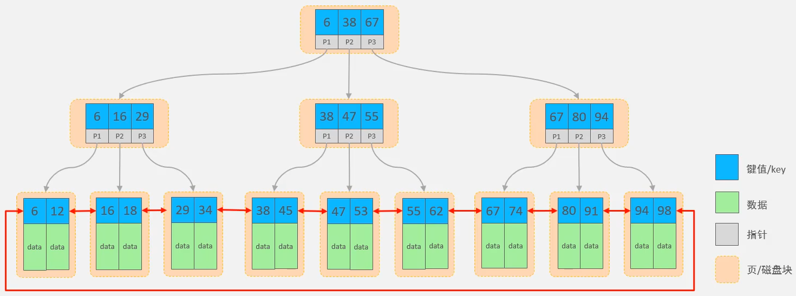
</p>

#### 语法
- 创建索引：`create [unique] index 索引名 on 表名(字段名,...);`
- 查看索引：`show index from 表名;`
- 删除索引：`drop index 索引名 on 表名;`
- 索引命名规范：`idx_表名_字段名`
- 注意事项：
    - 主键字段，在建表时，会自动创建主键索引，主键索引在所有索引中性能最高
    - 添加唯一约束时，数据库实际上会添加唯一索引
## MyBatis
### 入门
#### 什么是MyBatis？
- MyBatis是一款优秀的持久层框架，用于简化JDBC的开发
- MyBatis本是Apache的一个开源项目iBatis，2010年这个项目由apache迁移到了google code，并且改名为MyBatis，2013年11月迁移到Github
- [MyBatis官网](https://blog.mybatis.org/)
#### MyBatis操作数据库具体步骤
1. 准备工作（创建springboot工程、数据库表、实体类）
    - 选择起步依赖：MyBatis Framework、MySQL Driver
    - 实体类属性类型：Integer、String、Short、LocalDate、LocalDateTime
    - 构造实体类：生成Getter and Setter、toString()、Constructor有参构造以及无参构造
2. 引入Mybatis的相关依赖，配置Mybatis
    - 配置数据据库的连接信息 - 四要素
        ```
        #驱动类名称
        spring.datasource.driver-class-name=com.mysql.cj.jdbc.Driver
        #数据库连接的url
        spring.datasource.url=jdbc:mysql://localhost:3306/数据库名
        #连接数据库的用户名
        spring.datasource.username=root
        #连接数据库的密码
        spring.datasource.password=111111
        ```
3. 编写SQL语句（注解/XML）
<p align="center">
    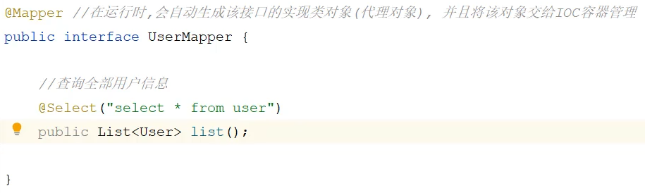
</p>

4. 单元测试
<p align="center">
    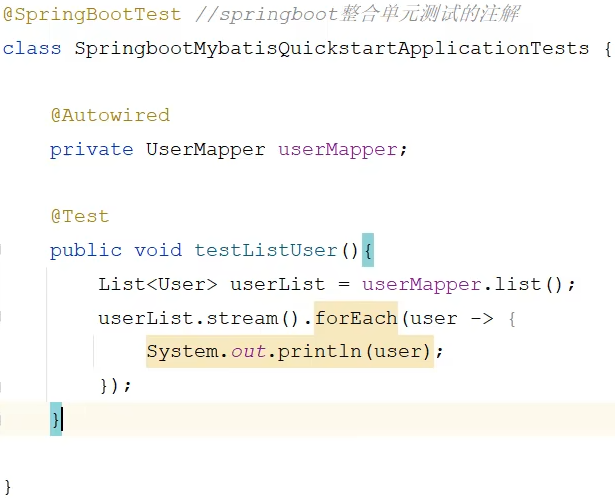
</p>

#### 配置SQL提示
- 默认在mybatis中编写SQL语句是不识别的，可以做如下配置：
<p align="center">
    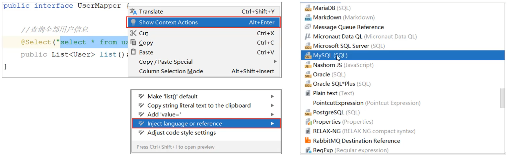
</p>

- 若Idea和数据库没有建立连接，不会识别表信息，会出现不提示表名或表名爆红，在Idea中配置MySQL数据库连接即可解决
#### JDBC介绍
- JDBC：（Java DataBase Connectivity），就是使用Java语言操作关系型数据库的一套API
- 本质：
    - sun公司官方定义的一套操作所有关系型数据库的规范，即接口
    - 各个数据库厂商去实现这套接口，提供数据库驱动jar包
    - 我们可以使用这套接口（JDBC）编程，真正执行的代码是驱动jar包中的实现类
#### 数据库连接池
- 数据库连接池是个容器，负责分配、管理数据库连接（Connection）
- 它允许应用程序重复使用一个现有的数据库连接，而不是再重新建立一个
- 释放空闲时间超过最大空闲时间的连接，来避免因为没有释放连接而引起的数据库连接遗漏
- 优势
    - 资源重用
    - 提升系统响应速度
    - 避免数据库连接遗漏
- 标准接口：DataSource
    - 官方（sun）提供的数据库连接池接口，由第三方组织实现此接口
    - 功能：获取连接 `Connection getConnection() throws SQLException;`
- 常见产品：
    - C3P0
    - DBCP
    - Druid
    - Hikari（springboot默认）
- Druid（德鲁伊）
    - Druid连接池是阿里巴巴开源的数据库连接池项目
    - 功能强大，性能优秀，是Java语言最好的数据库连接池之一
- 切换Druid数据库连接池
    - [官方地址](https://github.com/alibaba/druid/tree/master/druid-spring-boot-starter)
    - 引入Druid数据库连接池起步依赖
        ```
        <dependency>
            <groupId>com.alibaba</groupId>
            <artifactId>druid-spring-boot-starter</artifactId>
            <version>1.2.8</version>
        </dependency>
        ```
    - 配置数据库连接信息
        ```
        spring.datasource.(druid.)url=jdbc:mysql://localhost:3306/数据库名
        spring.datasource.(druid.)username=root
        spring.datasource.(druid.)password=111111
        spring.datasource.(druid.)driver-class-name=com.mysql.cj.jdbc.Driver
        ```
#### Lombok
- Lombok是一个实用的Java类库，能通过注解的形式自动生成构造器、getter/setter、equals、hashcode、toString等方法，并可以自动化生成日志变量，简化java开发、提高效率
- 常用注解：
    注解|作用
    :-|:-
    @Getter/@Setter|为所有的属性提供get/set方法
    @ToString|会给类自动生成易阅读的toString方法
    @EqualsAndHashCode|据类所拥有的非静态字段自动重写equals方法和hashcode方法
    @Data|提供了更综合的生成代码功能（@Getter+@Setter+@ToString+@EqualsAndHashcode）
    @NoArgsConstructor|为实体类生成无参的构造器方法
    @AllArgsConstructor|为实体类生成除了static修饰的字段之外带有各参数的构造器方法
- 引入Lombok依赖（起步依赖中勾选也可引入）
    ```
    <dependency>
        <groupld>org.projectlombok</groupld>
        <artifactId>lombok</artifactId>
    </dependency>
    ```
    - 无需指定version版本号，springboot父工程中集成了Lombok，将Lombok的版本统一进行管理
- 原理：在编译时期，根据对应的注解生成对应的方法
- 注意事项：Lombok会在编译时，自动生成对应的java代码，我们使用Lombok时，还需要安装一个Lombok的插件（Lombok，Idea自带）
### 基础操作
- 环境准备
    - 字段名在数据库表结构中使用下划线分隔，在实体类属性中采用标准的驼峰命名
- 删除
    - MyBatis提供的参数占位符`#{}`
    - 增删改操作语句的返回值代表此次操作影响的记录数
    - SQL语句：`delete from 表名 where 字段名 = 字段值;`
    - 接口方法：
        ```
        @Delete("delete from 表名 where 字段名 = #{字段值}")
        public void delete(字段类型 字段名);
        ```
    - 注意事项：如果mapper接口方法形参只有一个普通类型的参数，#{...}里面的属性名可以随便写，如：#{id}、#{value}
- 日志输出：可以在application.properties中，打开mybatis的日志，并指定输出到控制台
    ```
    #指定mybatis输出日志的位置，输出到控制台
    mybatis.configuration.log-impl=org.apache.ibatis.logging.stdout.StdOutImpl
    ```
- 预编译SQL
    - 性能更高
    - 更安全（防止SQL注入）
- SQL注入
    - SQL注入是通过操作输入的数据来修改事先定义好的SQL语句，以达到执行代码对服务器进行攻击的方法
- 参数占位符
    - `#{...}`
        - 执行SQL时，会将`#{...}`替换为?，生成预编译SQL，会自动设置参数值
        - 使用时机：参数传递，都使用`#{...}`
    - `${...}`
        - 拼接SQL，直接将参数拼接在SQL语句中，存在SQL注入问题
        - 使用时机：如果对表名、列表进行动态设置时使用
- 新增
    - SQL语句：`insert into 表名(字段名1,字段名2,...) values('字段值1,字段值2,...');`
    - 接口方法：
        ```
        @Insert("insert into 表名(字段名1,字段名2,...) values(#{属性名1},#{属性名2},...)")
        public void insert(对象 对象名)
        ```
    - 注意： 如果有多个参数，可以使用实体对象将多个参数封装起来，在sql语句中使用`#{}`这种参数占位符的形式获取对象中的属性，即填写属性名而非字段名，属性名使用驼峰命名
    - 主键返回
        - 描述：在数据添加成功后，需要获取插入数据库数据的主键
        - 实现：
            ```
            #会自动将生成的主键值赋值给对象的指定属性
            @Options(KeyProperty='属性名',useGeneratedKeys=true)
            @Insert("insert into 表名(字段名1,字段名2,...) values(#{属性名1},#{属性名2},...)")
            public void insert(对象 对象名);
            ```
- 更新
    - SQL语句：`update 表名 set 字段名1='字段值1',字段名2='字段值2',... where 条件;`
    - 接口方法：
        ```
        @Update("update 表名 set 字段名1=#{属性名1},字段名2=#{属性名2},... where 条件")
        public void update(对象 对象名);
        ```
- 查询
    - 根据ID查询
        - SQL语句：`select * from 表名 where id = id值;`
        - 接口方法：
            ```
            @Select("select * from 表名 where id = #{id}")
            public 对象名 getById(Integer id);
            ```
    - 条件查询
        - SQL语句：`select * from 表名 where 字段名1 like '%字段值1%' and 字段名2 = 字段值2 and ... order by 字段名3 desc;`
        - 接口方法1：
            ```
            @Select("select * from 表名 where 字段名1 like '$形参1%' and 字段名2 = 形参2 and ... order by 字段名3 desc")
            public List<对象名> list(形参1类型 形参1, 形参2类型 形参2,...);
            ```
        - concat：字符串拼接函数
        - 接口方法2（推荐）（在spingboot的2.x版本）：
            ```
            @Select("select * from 表名 where 字段名1 like concat('%',#{形参1},'%') and 字段名2 = 形参2 and ... order by 字段名3 desc")
            public List<对象名> list(形参1类型 形参1, 形参2类型 形参2,...);
            ```
        - 接口方法3（在spingboot的3.x版本/单独使用mybatis）：
            ```
            @Select("select * from 表名 where 字段名1 like concat('%',#{指定形参名1},'%') and 字段名2 = 指定形参名2 and ... order by 字段名3 desc")
            public List<对象名> list(@Param("指定形参名1")形参1类型 形参1, @Param("指定形参名2")形参2类型 形参2,...);
            ```
- 数据封装
    - 实体类属性名和数据库表查询返回的字段名一致，mybatis会自动封装
    - 如果实体类属性名和数据库表查询返回的字段名不一致，不能自动封装
    - 解决方案：
        - 起别名：在SQL语句中，对不一样的列名起别名，别名和实体类属性名一样
        - 手动结果映射：通过@Results及@Result进行手动结果映射
            ```
            @Results({
                @Result(column="a_column",property="aColumn"),
                ...
            })
            ```
        - 开启驼峰命名：如果字段名与属性名符合驼峰命名规则，mybatis会自动通过驼峰命名规则映射
            ```
            #开启驼峰命名自动映射，即从数据库字段名a_column映射到Java属性名aColumn
            mybatis.configuration.map-underscore-to-camel-case=true
            ```
### XML映射文件
#### 规范
- XML映射文件的名称与Mapper接口名称一致，并且将XML映射文件和Mapper接口放置在相同包下（同包同名）
    - 不同于java目录下New Package创建包用`.`分隔，在resources目录下New Directory创建包需要用`/`分隔
    - xml配置文件中需要约束，官方文档拷贝如下：
        ```
        <?xml version="1.0" encoding="UTF-8" ?>
        <!DOCTYPE mapper
            PUBLIC "-//mybatis.org//DTD Mapper 3.0//EN"
            "http://mybatis.org/dtd/mybatis-3-mapper.dtd">
        ```
- XML映射文件的namespace属性为Mapper接口全限定名（接口右键选择Copy Reference）一致
- XML映射文件中sql语句的id与Mapper接口中的方法名一致，并保持返回类型一致(resultType：单条记录所封装的类型，右键选择Copy Reference)
#### 基于XML映射语句的示例
```
<?xml version="1.0" encoding="UTF-8" ?>
<!DOCTYPE mapper
    PUBLIC "-//mybatis.org//DTD Mapper 3.0//EN"
    "http://mybatis.org/dtd/mybatis-3-mapper.dtd">
<mapper namespace="org.mybatis.example.BlogMapper">
    <select id="selectBlog" resultType="Blog">
        select * from Blog where id = #{id}
    </select>
</mapper>
```
#### MybatisX
- MyBatisX是一款基于IDEA的快速开发MyBatis的插件，为效率而生
#### 说明
- 使用MyBatis的注解，主要是来完成一些简单的增删改查功能。如果需要实现复杂的SQL功能，建议使用XML来配置映射语句
- [官方文档](https://mybatis.net.cn/getting-started.html)
### 动态SQL
#### 概述
- 随着用户的输入或外部条件的变化而变化的SQL语句，我们称为动态SQL
#### 标签
- \<if>：用于判断条件是否成立。使用test属性进行条件判断，如果条件为true，则拼接SQL
    - 形式：
        ```
        <if test="name != null">
        ...
        <if>
        ```
- \<where>：where元素只会在子元素有内容的情况下才插入where子句，而且会自动去除子句开头的and或or
- \<set>：动态地在行首插入set关键字，并会删掉额外的逗号（用在update语句中）
- \<foreach>（循环遍历元素）：
    - 形式：
        ```
        <delete id="deleteByIds">
            delete from 表名 where id in
            <foreach collection="ids" item="id" separator="," open="(" close=")">
                #{id}
            </foreach>
        </delete>
        ```
    - 属性：
        - collection：集合名称
        - item：集合遍历出的元素/项
        - separator：每一次遍历使用的分隔符
        - open：遍历开始前拼接的片段
        - close：遍历结束后拼接的片段
- SQL片段：
    - \<sql>：定义可重用的SQL片段，通过属性id指定唯一标识
    - \<include>：通过属性refid，指定包含的SQL片段
## SpringBoot后端工程
### 环境搭建
1. 准备数据库表
2. 创建springboot工程，引入对应的起步依赖（web、mybatis、mysql驱动、lombok）
<p align="center">
    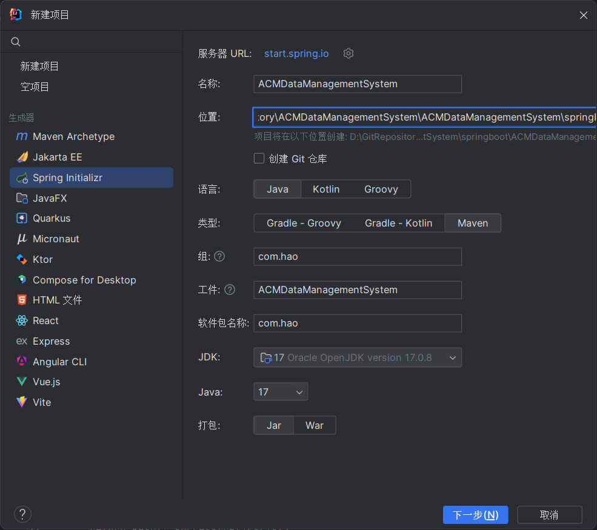
</p>
<p align="center">
    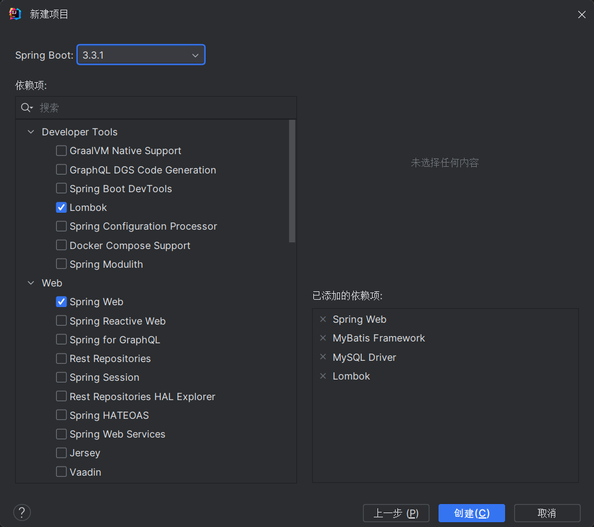
</p>

3. 配置文件application.properties中引入mybatis的配置信息，准备对应的实体类
4. 准备对应的Mapper、Service（接口、实现类）、Controller基础结构