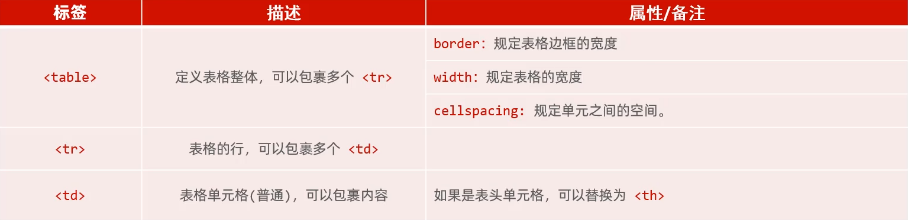
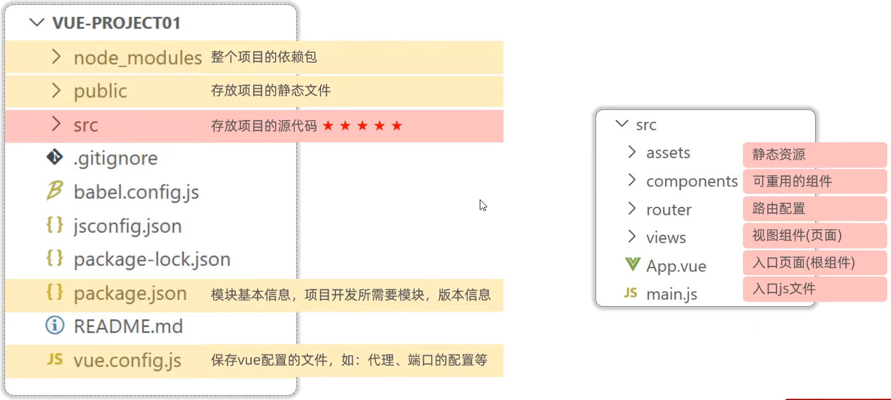
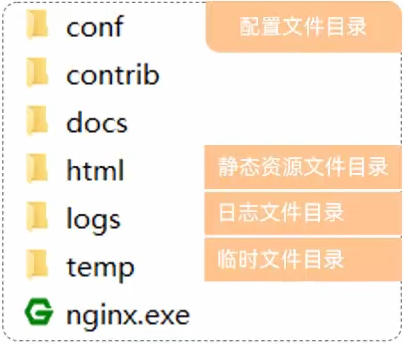

# JawaWeb前端技术
## Web
### 什么是Web
- 全球广域网，也称为万维网（www World Wide Web），能够通过浏览器访问的网站
### Web网站的工作流程
1. 用户在浏览器地址栏输入域名并访问
2. 浏览器根据请求的域名请求对应的前端服务器，前端服务器接收到请求后把对应的前端代码返回给浏览器，浏览器内置的解析引擎自动解析并渲染展示前端代码页面结构
3. 浏览器解析到前端代码中的数据获取路径后访问部署在后端服务器中的后端程序，后端程序访问数据库获取数据后将数据返回给浏览器，浏览器将数据填充形成完整页面
### 浏览器内核
- 浏览器中对代码进行解析渲染的部分，成为浏览器内核
- 不同的浏览器，内核不同，对于相同的前端代码解析的效果会存在差异
### Web标准
- Web标准也称为网页标准，由一系列的标准组成，大部分由W3C（World Wide Web Consortium，万维网联盟）负责制定
- 三个组成部分：
    - HTML：负责网页的结构（页面元素和内容）
    - CSS：负责网页的表现（页面元素的外观、位置等页面样式，如：颜色、大小等）
    - JavaScript：负责网页的行为（交互效果）
## VS Vode
- [安装以及插件配置教程](https://www.bilibili.com/video/BV1m84y1w7Tb?t=34.8&p=5)
- HTML结构标签一键生成：输入`！`并回车
    ```
    <!-- 文档类型为HTML -->
    <!DOCTYPE html>
    <html lang="en">
    <head>
        <!-- 字符集为UTF-8 -->
        <meta charset="UTF-8">
        <!-- 设置浏览器兼容性 -->
        <meta name="viewport" content="width=device-width, initial-scale=1.0">
        <title>Document</title>
    </head>
    <body>
        
    </body>
    </html>
    ```
## HTML
- HTML（HyperText Markup Language）：超文本标记语言
    - 超文本：超越了文本的限制，比普通文本更强大。除了文字信息，还可以定义图片、音频、视频等内容
    - 标记语言：由标签构成的语言
- HTML标签都是预定义好的。例如：使用`<a>`展示超链接，使用``展示图片，`<video>`展示视频
- HTML代码直接在浏览器中运行，HTML标签由浏览器解析
### HTML结构标签
```
<html>
    <head>
        <title>标题</title>
    </head>
    <body>

    </body>
</html>
```
### HTML特点
- HTML标签不区分大小写
- HTML标签属性既可以使用单引号也可以使用双引号
- HTML标签语法结构较松散
### 常用标签
#### 图片标签：``
- src：指定图像的url（绝对路径/相对路径）
    - 路径书写方式：
        - 绝对路径：
            1. 绝对磁盘路径（`D:/xxx`）
            2. 绝对网络路径（`https://xxx`）
        - 相对路径：
            - `./`：当前目录，可以省略
            - `../`：上一级目录，不可省略
- width：图像的宽度（`px`，像素；`%`，相对于父元素的百分比）
- height：图像的高度（`px`，像素；`%`，相对于父元素的百分比）
#### 标题标签：`<h1>`-`<h6>`
#### 水平线标签：`<hr>`
## CSS
- CSS（Cascading Style Sheet）：层叠样式表，用于控制页面的样式（表现）  
[W3school](https://www.w3school.com.cn/)
### CSS引入方式
- 行内样式：写在标签的style属性中（不推荐）（`<h1 style="...">`）
- 内嵌样式：写在style标签中（可以写在页面任何位置，但通常约定写在head标签中）（`<style>...</style>`）
- 外联样式：写在一个单独的.css文件中（需要通过link标签在网页中引入）（`xxx.css <link href="...">`）
### `<span>`标签
- `<span>`是一个在开发网页时大量会用到的没有语义的布局标签
- 特点：一行可以显示多个（组合行内元素），宽度和高度默认由内容撑开
### CSS选择器
- 用来选取需要设置样式的元素（标签）
- 元素选择器：标签名 {...}
- id选择器：#id属性值 {...}
- 类选择器：.class属性值 {...}
- 优先级：id选择器 > 类选择器 > 元素选择器
### CSS属性
- color：设置文本的颜色
- font-size：字体大小（注意：记得加px）
#### 颜色表示形式
表示方式|表示含义|取值
:-:|:-|:-
关键字|预定义的颜色名|red、green、blue...
rgb表示法|红绿蓝三原色，每项取值范围：0-255|rgb(0,0,0)、rgb(255,255,255)、rgb(255,0,0)
十六进制表示法|#开头，将数字转换成十六进制表示|#000000、#ff0000、#cccccc，简写：#000、#ccc
### 超链接标签
#### 标签
- `<a href="..." target="...">超链接</a>`
#### 属性
- href：指定资源访问的url
- target：指定在何处打开资源链接
    - _self：默认值，在当前页面打开
    - _blank：在空白页面打开
- text-decoration：规定添加到文本的修饰，none表示定义标准的文本
- color：定义文本的颜色
### 视频标签
#### 标签
- `<video>`
#### 属性
- src：规定视频的url
- controls：显示播放控件
- width：播放器的宽度
- height：播放器的高度
### 音频标签
#### 标签
- `<audio>`
#### 属性
- src：规定音频的url
- controls：显示播放控件
### 音频标签：`<p>`
### 文本加粗标签：`<b>` / `<strong>`
### 换行标签：`<br>`
### CSS样式
- line-height：设置行高
- text-indent：定义第一个行内容的缩进
- text-align：规定元素中的文本的水平对齐方式
- 注意：在HTML中无论输入多少个空格，只会显示一个。可以使用空格占位符：`&nbsp;`
### 盒子模型
#### 盒子
- 页面中所有的元素（标签），都可以看做是一个盒子，由盒子将页面中的元素包含在一个矩形区域内，通过盒子的视角更方便的进行页面布局
#### 盒子模型组成
- 内容区域（content）、内边距区域（padding）、边框区域（border）、外边距区域（margin）
### 布局标签
- 实际开发网页中，会大量频繁的使用div和span这两个没有语义的布局标签。
#### 标签：`<div>` `<span>`
#### 特点
- div标签
    - 一行只显示一个（独占一行）
    - 宽度默认是父元素的宽度，高度默认由内容撑开
    - 可以设置宽高（width、height）
- span标签
    - 一行可以显示多个
    - 宽度和高度默认由内容撑开
    - 不可以设置宽高（width、height）
#### CSS属性
- width：设置宽度
- height：设置高度
- border：设置边框的属性，如：`1px solid #000;`
- padding：内边距
- margin：外边距
- 注意：如果只需要设置某一个方位的边框、内边距、外边距，可以在属性名后加上-位置，如：padding-top、padding-left、padding-right...
### 表格标签
- 场景：在网页中以表格（行、列）形式整齐展示数据
#### 标签
<p align="center">
    
</p>

### 表单标签
- 场景：在网页中主要负责数据采集功能，如注册、登录等数据采集
#### 标签：`<form>`
#### 属性
- action：规定当提交表单时向何处发送表单数据，URL
- method：规定用于发送表单数据的方式。GET、POST
    - get：表单数据拼接在url后面，?username=java,大小有限制
    - post：表单数据在请求体中携带，大小没有限制
- 注意：表单项必须有name属性才可以提交
#### 表单项
- 不同类型的input元素、下拉列表、文本域等
    - `<input>`：定义表单项，通过type属性控制输入形式
        type取值|描述
        :-:|:-
        text|默认值，定义单行的输入字段
        password|定义密码字段
        radio|定义单选按钮
        checkbox|定义复选框
        file|定义文件上传按钮
        date/time/datetime-local|定义日期/时间/日期时间
        number|定义数字输入框
        email|定义邮件输入框
        hidden|定义隐藏域
        submit/reset/button|定义提交按钮/重置按钮/可点击按钮
    - `<select>`：定义下拉列表，`<option>`定义列表项
    - `<textarea>`：定义文本域
## JavaScript
### 什么是JavaScript
- JavaScript（简称：JS）是一门跨平台、面向对象的脚本语言。是用来控制网页行为的，它能使网页可交互
- JavaScript和Java是完全不同的语言，不论是概念还是设计。但是基础语法类似
- JavaScript在1995年由Brendan Eich发明，并于1997年成为ECMA标准
    - ECMA：ECMA国际（前身为欧洲计算机制造商协会），制定了标准化的脚本程序设计语言ECMAScript，这种语言得到广泛应用。而JavaScript是遵守ECMAScript的标准的
- ECMAScript6（ES6）是最新的JavaScript版本（发布于2015年）
### JavaScript引入方式
#### 内部脚本
- 将JS代码定义在HTML页面中
- JavaScript代码必须位于`<script> </script>`标签之间
- 在HTML文档中，可以在任意地方，放置任意数量的`<script>`
- 一般会把脚本置于`<body>`元素的底部，可改善显示速度
#### 外部脚本
- 将JS代码定义在外部JS文件中，然后引入到HTML页面中
- 外部JS文件中，只包含JS代码，不包含`<script>`标签
- `<script>`标签不能自闭合
### 基础语法
#### 书写语法
- 区分大小写：与Java一样，变量名、函数名以及其他一切东西都是区分大小写的
- 每行结尾的分号可有可无
- 注释
    - 单行注释：`//注释内容`
    - 多行注释：`/*注释内容*/`
- 大括号表示代码块
#### 输出语句
- 使用window.alert()写入警告框
- 使用document.write()写入HTML输出
- 使用console.log()写入浏览器控制台
#### 变量
- JavaScript中用var关键字（variable的缩写）来声明变量
- JavaScript是一门弱类型语言，变量可以存放不同类型的值
- 变量名需要遵循如下规则
    - 组成字符可以是任何字母、数字、下划线（_）或美元符号（$）
    - 数字不能开头
    - 建议使用驼峰命名
- 注意事项：
    - ECMAScript6新增了let关键字来定义变量。它的用法类似于var，但是所声明的变量，只在let关键字所在的代码块内有效，且不允许重复声明
    - ECMAScript6新增了const关键字，用来声明一个只读的常量。一旦声明，常量的值就不能改变
#### 数据类型
- JavaScript中分为：原始类型和引用类型
- 原始类型
    - number：数字（整数、小数、NaN（Not aNumber））
    - string：字符串，单双引皆可
    - boolean：布尔。true，false
    - null：对象为空
    - undefined：当声明的变量未初始化时，该变量的默认值是undefined
- 使用typeof运算符可以获取数据类型
#### 运算符
- 算术运算符：+，-，*，/，%，++，--
- 赋值运算符：=，+=，-=，*=，/=，%=
- 比较运算符：>，<，>=，<=，!=，==，===
    - ==会进行类型转换，===不会进行类型转换
- 逻辑运算符：&&，||，!
- 三元运算符：条件表达式?true_value:false_value
#### 类型转换
- 字符串类型转为数字（`parseInt()`）
    - 将字符串字面值转为数字。如果字面值不是数字，则转为NaN
- 其他类型转为boolean
    - Number：0和NaN为false，其他均转为true
    - String：空字符串为false，其他均转为true
    - Null和undefined：均转为false
#### 流程控制语句
- if...else if...else
- switch
- for
- while
- do...while
- [JS语句官方文档](https://www.w3school.com.cn/js/js_statements.asp)
### 函数
#### 概述
- 介绍：函数（方法）是被设计为执行特定任务的代码块
- 定义：JavaScript函数通过function关键字进行定义，语法为:
    ```
    function functionName(参数1,参数2...){
        //要执行的代码
    }
    ```
- 定义方式二：
    ```
     var functionName = function(参数1,参数2...){
        //要执行的代码
    }
    ```
- 注意:
    - 形式参数不需要类型。因为JavaScript是弱类型语言
    - 返回值也不需要定义类型，可以在函数内部直接使用return返回即可
- 调用：函数名称(实际参数列表)
- JS中，函数调用可以传递任意个数的参数
#### 箭头函数（ES6）
- 用来简化函数定义语法。具体形式为：`(...) => {...}`，如果需要给箭头函数命名：`var xxx = (...) => {...}`
### 对象
#### Array数组
- JavaScript中Array对象用于定义数组
- 定义
    ```
    var 变量名 = new Array(元素列表); //方式一
    var 变量名 = [元素列表]; //方式二
    ```
- 访问：`arr[索引] = 值`
- JavaScript中的数组相当于Java中的集合，数组的长度是可变的，而JavaScript是弱类型，所以可以存储任意的类型的数据
- 属性
    属性|描述
    :-:|:-
    length|设置或返回数组中元素的数量
- 方法
    方法|描述
    :-:|:-
    forEach()|遍历数组中的每个有值的元素，并调用一次传入的函数
    push()|将新元素添加到数组的末尾，并返回新的长度
    splice()|从数组中删除元素
#### String字符串
- 创建方式
    ```
    var 变量名 = new String("..."); //方式一
    var 变量名 = "..."; //方式二
    ```
- 属性
    属性|描述
    :-:|:-
    length|字符串的长度
- 方法
    方法|描述
    :-:|:-
    charAt()|返回在指定位置的字符
    indexOf()|检索字符串
    trim()|去除字符串两边的空格
    substring(start,end)|提取字符串中两个指定的索引号之间的字符（含头不含尾）
#### 自定义对象
- 定义格式
    ```
    var 对象名 = {
        属性名1:属性值1,
        属性名2:属性值2,
        属性名3:属性值3,
        函数名称[:function](形参列表){}
    };
    ```
- 调用格式
    ```
    对象名.属性名;
    对象名.函数名();
    ```
#### JSON
- 概念：JavaScript Object Notation，JavaScript对象标记法
- JSON是通过JavaScript对象标记法书写的文本
- 由于其语法简单，层次结构鲜明，现多用于作为数据载体，在网络中进行数据传输
- 定义：`var 变量名 = '{"key1":value1, "key2":value2}';`
    - value的数据类型为：
        - 数字（整数或浮点数）
        - 字符串（在双引号中）
        - 逻辑值（true或false）
        - 数组（在方括号中）
        - 对象（在花括号中）
        - null
- JSON字符串转为JS对象：`var jsobject = JSON.parse(userstr);`
- JS对象转为JSON字符串：`var jsonstr = JSON.stringify(jsobject);`
#### BOM
- 概念：Browser Object Model，浏览器对象模型，允许JavaScript与浏览器对话，JavaScript将浏览器的各个组成部分封装为对象
- 组成
    - Window：浏览器窗口对象
    - Navigator：浏览器对象
    - Screen：屏幕对象
    - History：历史记录对象
    - Location：地址栏对象
- Window
    - 介绍：浏览器窗口对象
    - 获取：直接使用`window`，其中`window.`可以省略
    - 属性
        - history：对History对象的只读引用。[请参阅History对象](https://www.w3school.com.cn/js/js_window_history.asp)
        - location：用于窗口或框架的Location对象。[请参阅Location对象](https://www.w3school.com.cn/js/js_window_location.asp)
        - navigator：对Navigator对象的只读引用。[请参Navigator对象](https://www.w3school.com.cn/js/js_window_navigator.asp)
    - 方法
        - alert()：显示带有一段消息和一个确认按钮的警告框
        - confirm()：显示带有一段消息以及确认按钮和取消按钮的对话框
        - setlnterval()：按照指定的周期（以毫秒计）来调用函数或计算表达式
        - setTimeout()：在指定的毫秒数后调用函数或计算表达式
- Location
    - 介绍：地址栏对象
    - 获取：使用`window.location`获取，其中`window.`可以省略
    - 属性
        - href：设置或返回完整的URL
#### DOM
- 概念：Document Object Model，文档对象模型
- 将标记语言的各个组成部分封装为对应的对象：
    - Document：整个文档对象
    - Element：元素对象
    - Attribute：属性对象
    - Text：文本对象
    - Comment：注释对象
- JavaScript通过DOM，就能够对HTML进行操作：
    - 改变HTML元素的内容
    - 改变HTML元素的样式（CSS）
    - 对HTML的DOM事件作出反应
    - 添加和删除HTML元素
- DOM是W3C（万维网联盟）的标准，定义了访问HTML和XML文档的标准，分为3个不同的部分：
    1. Core DOM - 所有文档类型的标准模型
        - Document：整个文档对象
        - Element：元素对象
        - Attribute：属性对象
        - Text：文本对象
        - Comment：注释对象
    2. XML DOM - XML文档的标准模型
    3. HTML DOM - HTML文档的标准模型
        - Image：``
        - Button：`<input type='button'>`
- HTML中的Element对象可以通过Document对象获取，而Document对象是通过window对象获取的
- Document对象中提供了以下获取Element元素对象的函数：
    1. 根据id属性值获取，返回单个Element对象  
    `var h1 = document.getElementById('h1');`
    2. 根据标签名称获取，返回Element对象数组  
    `var divs = document.getElementsByTagName('div');`
    3. 根据name属性值获取，返回Element对象数组  
    `var hobbys = document.getElementsByName('hobby');`
    4. 根据class属性值获取，返回Element对象数组  
    `var clss = document.getElementsByClassName('cls');`
### 事件监听
#### 事件
- HTML事件是发生在HTML元素上的“事情”，比如：
    - 按钮被点击
    - 鼠标移动到元素上
    - 按下键盘按键
#### 事件监听
- JavaScript可以在事件被侦测到时执行代码
#### 事件绑定
- 方式一：通过HTML标签中的事件属性进行绑定
    ```
    <input type="button" onclick="on()" value="按钮1">

    <script>
        function on(){
            alert('我被点击了!);
        }
    </script>
    ```
- 方式二：通过DOM元素属性绑定
    ```
    <input type="button" id="btn" value="按钮2">

    <script>
        document.getElementById('btn').onclick=function(){
            alert('我被点击了!');
        }
    </script>
    ```
#### 常见事件
事件名|说明
:-:|:-:
onclick|鼠标单击事件
onblur|元素失去焦点
onfocus|元素获得焦点
onload|某个页面或图像被完成加载
onsubmit|当表单提交时触发该事件
onkeydown|某个键盘的键被按下
onmouseover|鼠标被移到某元素之上
onmouseout|鼠标从某元素移开
## Vue
### 概述
#### 什么是Vue？
- Vue是一套前端框架，免除原生JavaScript中的DOM操作，简化书写
    - 框架：是一个半成品软件，是一套可重用的、通用的、软件基础代码模型。基于框架进行开发，更加快捷、更加高效
- 基于MVVM（Model-View-ViewModel）思想，实现数据的双向绑定，将编程的关注点放在数据上
- 即Vue是一个基于MVVM模型的前端js框架
- [Vue官网](https://cn.vuejs.org/)
#### 插值表达式
- 形式：`{{表达式}}`
- 内容可以是：
    - 变量
    - 三元运算符
    - 函数调用
    - 算术运算
### 指令
- 指令：HTML标签上带有v-前缀的特殊属性，不同指令具有不同含义。例如：v-if，v-for...
#### 常用指令
指令|作用
:-:|:-
v-bind|为HTML标签绑定属性值，如设置href，css样式等
v-model|在表单元素上创建双向数据绑定
v-on|为HTML标签绑定事件
v-if<br>v-else-if<br>v-else|条件性的渲染某元素，判定为true时渲染，否则不渲染
v-show|根据条件展示某元素，区别在于切换的是display属性的值
v-for|列表渲染，遍历容器的元素或者对象的属性
- 通过v-bind或者v-model绑定的变量，必须在数据模型中声明
### 生命周期
- 生命周期：指一个对象从创建到销毁的整个过程
- 生命周期的八个阶段：每触发一个生命周期事件，会自动执行一个生命周期方法（钩子）
    状态|阶段周期
    :-:|:-:
    beforeCreate|创建前
    created|创建后
    beforeMount|挂载前
    mounted|挂载完成
    beforeUpdate|更新前
    updated|更新后
    beforeDestroy|销毁前
    destroyed|销毁后
- mounted：挂载完成，Vue初始化成功，HTML页面渲染成功（发送请求到服务端，加载数据）
## Ajax
### 概述
#### 概念
- Asynchronous JavaScript And XML，异步的JavaScript和XML
#### 作用
- 数据交换：通过Ajax可以给服务器发送请求，并获取服务器响应的数据
- 异步交互：可以在不重新加载整个页面的情况下，与服务器交换数据并更新部分网页的技术，如：搜索联想、用户名是否可用的校验等等
### 原生Ajax
```
Function loadDoc()

function loadDoc() {
    //1.创建XMLHttpRequest
    var xhttp = new XMLHttpRequest();

    //3.获取服务响应数据
    xhttp.onreadystatechange = function() {
        if (this.readyState == 4 && this.status == 200) {
        document.getElementById("demo").innerHTML = this.responseText;
        }
    };

    //2.发送异步请求
    xhttp.open("GET", "ajax_info.txt", true);
    xhttp.send();
}
```
### Axios
- Axios对原生的Ajax进行了封装，简化书写，快速开发
- [Axios官网](https://www.axios-http.cn/)
#### 请求方式
```
axios({
    method:"get",
    url="http://xxx"
}).then(result => {
    console.log(result.data);
})

axios({
    method:"post",
    url="http://xxx",
    data:"id=1"
}).then(result => {
    console.log(result.data);
})
```
#### 请求方式别名
```
axios.get(url[,config])
axios.delete(url[,config])
axios.post(url[,data[,config]])
axios.put(url[,data[,config]])
```
## YApi
- 介绍：YApi是高效、易用、功能强大的api管理平台，旨在为开发、产品、测试人员提供更优雅的接口管理服务
- [YApi官网](https://yapi.pro/)
## 前端工程化
- 是指在企业级的前端项目开发中，把前端开发所需的工具技术、流程、经验等进行规范化、标准化
### Vue-cli
- Vue-cli是Vue官方提供的一个脚手架，用于快速生成一个Vue的项目模板
- Vue-cli提供了如下功能
    - 统一的目录结构
    - 本地调试
    - 热部署
    - 单元测试
    - 集成打包上线
- 依赖环境：NodeJS
    - [NodeJS安装教程](https://www.bilibili.com/video/BV1m84y1w7Tb?t=332.2&p=37)
    - 最新npm淘宝镜像：`https://www.bilibili.com/video/BV1m84y1w7Tb?t=332.2&p=37`
### 创建Vue项目
- 命令行：`vue create vue-project01`
- 图形化界面：`vue ui`
#### 步骤
1. 在图形化界面中创建新项目
2. 输入项目名称，选择npm包管理器（NodeJS环境）（，取消勾选初始化Git仓库）
3. 选择手动配置项目，选择Router路由功能
4. 选择2.x版本，选择语法检测规范（ESLint with error prevention only）
5. 创建项目（，不保存预设）
#### 目录结构
- 基于Vue脚手架创建出来的工程，有标准的目录结构，如下
<p align="center">
    
</p>

#### 配置端口
- 在vue.config.js文件中增加如下配置：
    ```
    const { defineConfig } = require('@vue/cli-service')
    module.exports = defineConfig({
      transpileDependencies: true,
      devServer: {
        port: 7000
      }
    })
    ```
### Vue项目开发流程
- Vue的组件文件以.vue结尾，每个组件由三个部分组成:`<template>`、`<script>`、`<style>`
- `<template>`：模板部分，由它生成HTML代码
- `<script>`：定义JS代码，控制模板的数据来源和行为
- `<style>`：CSS样式部分
#### Vue项目中使用Axios
- 在项目目录下安装axios：`npm install axios`
- 需要使用axios时，导入axios：`import axios from 'axios'`
#### Vue路由
- URL中的hash（#号）与组件之间的对应关系
- Vue Router：Vue的官方路由
    - 组成：
        - VueRouter：路由器类，根据路由请求在路由视图中动态渲染选中的组件
        - \<router-link>：请求链接组件，浏览器会解析成`<a>`
        - \<router-view>：动态视图组件，用来渲染展示与路由路径对应的组件
## Element
### 什么是Element
- Element：是饿了么团队研发的，一套为开发者、设计师和产品经理准备的基于Vue 2.0的桌面端组件库
- 组件：组成网页的部件，例如：超链接、按钮、图片、表格、表单、分页条等等
- [Element官网](https://element.eleme.cn/#/zh-CN)
### 配置
- 安装ElementUI组件库（在当前工程的目录下，集成终端中打开），在命令行执行指令：  
`npm i element-ui -S`
- 在入口文件main.js中引入ElementUI组件库  
    ```
    import Vue from 'vue';
    import ElementUI from 'element-ui';
    import 'element-ui/lib/theme-chalk/index.css';
    import App from './App.vue';

    Vue.use(ElementUI);

    new Vue({
      el: '#app',
      render: h => h(App)
    });
    ```
- 组件名一般采用驼峰命名
- 组件文件基本框架
    ```
    <template>
    <div>

    </div>
    </template>

    <script>
    export default {
    data() {
        return {
        
        }
    },
    methods: {
        
    },
    }
    </script>

    <style>

    </style>
    ```
## 打包部署
### 打包
- build打包后存储在dist目录下
### 部署
#### Nginx
- 介绍：Nginx是一款轻量级的Web服务器/反向代理服务器及电子邮件（IMAP/POP3）代理服务器。其特点是占有内存少，并发能力强，在各大型互联网公司都有非常广泛的使用
- [Nginx官网](https://nginx.org/)
- Nginx安装目录
<p align="center">
    
</p>

- 部署：将打包好的dist目录下的文件，复制到nginx安装目录的html目录下
- 启动：双击nginx.exe文件即可，Nginx服务器默认占用80端口号
- 命令行查询端口号占用情况指令：`netstat -ano | findStr XX`，最后一列代表进程ID（PID）
- 更换Nginx默认端口号：conf/nginx.conf配置文件中36行更改默认端口listen的端口号